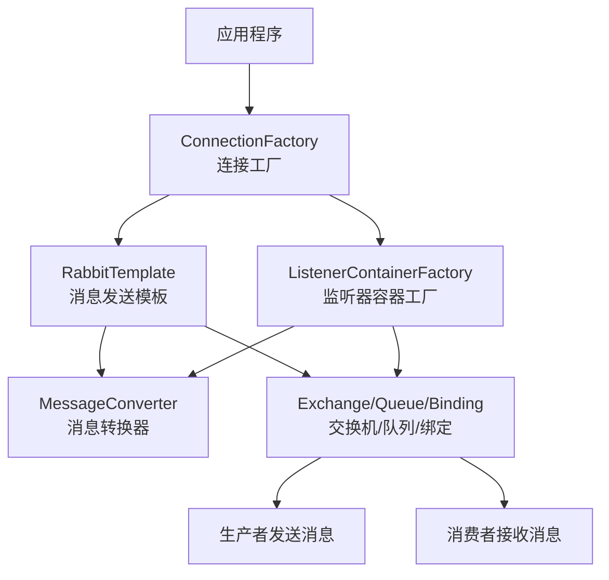

在 Spring Boot 中配置 RabbitMQ 需要设置一系列核心 Bean 来建立消息发送和接收的完整管道。下面这个流程图直观地展示了这些核心组件如何协同工作：



下面详细介绍每个核心 Bean 的配置方法和作用：
```
<dependency>
    <groupId>org.springframework.boot</groupId>
    <artifactId>spring-boot-starter-amqp</artifactId>
</dependency>
```
## 配置yaml文件设置重试机制
```
spring:  
  rabbitmq:  
    listener:  
      direct:  
        retry:  
          enabled: true  
          max-attempts: 3  
          initial-interval: 1000ms  
          multiplier: 2  
          max-interval: 10000ms  
    publisher-confirm-type: correlated  
```
## 🔧 核心 Bean 配置详解


### 1. ConnectionFactory（连接工厂）
作用：创建到 RabbitMQ 服务器的连接，是其他所有组件的基础。

```yaml
# 基础配置（application.yml）
spring:
  rabbitmq:
    host: localhost
    port: 5672
    username: guest
    password: guest
    virtual-host: /
```

```java
// 自定义连接工厂配置
@Bean  
public ConnectionFactory connectionFactory() {  
    CachingConnectionFactory connectionFactory = new CachingConnectionFactory();  
    connectionFactory.setHost("192.168.0.10");  
    connectionFactory.setPort(5672);  
    connectionFactory.setUsername("hongxu");  
    connectionFactory.setPassword("h3800168");  
    connectionFactory.setVirtualHost("/");  
    return connectionFactory;  
}
```

### 2. RabbitTemplate（消息模板）
作用：用于发送消息的核心组件。

```java
@Bean  
public RabbitTemplate rabbitTemplate(ConnectionFactory connectionFactory,MessageConverter jsonMessageConverter) {  
    RabbitTemplate rabbitTemplate = new RabbitTemplate();  
    rabbitTemplate.setConnectionFactory(connectionFactory);  
    rabbitTemplate.setMandatory(true);  
    rabbitTemplate.setMessageConverter(jsonMessageConverter);  
    rabbitTemplate.setConfirmCallback(new RabbitTemplate.ConfirmCallback() {  
  
        @Override  
        public void confirm(CorrelationData correlationData, boolean ack, String cause) {  
            if(!ack){  
                System.out.println("消息发送失败,无法发送到RabbitMQ: " + cause);  
            }  
        }  
    });  
    rabbitTemplate.setReturnsCallback(new RabbitTemplate.ReturnsCallback() {  
  
        @Override  
        public void returnedMessage(ReturnedMessage returnedMessage) {  
            System.err.println("ReturnsCallback: 消息路由到队列失败！回应码: " +  
                    returnedMessage.getReplyCode() + ", 原因: " + returnedMessage.getReplyText() +  
                    ", 交换机: " + returnedMessage.getExchange() + ", 路由键: " + returnedMessage.getRoutingKey());  
        }  
    });  
    return rabbitTemplate;  
  
  
}
```
- setMandatory(true): 
	- 配置含义：
		- 当设置为 true时，如果消息从交换机路由到队列失败（例如，没有匹配的队列），RabbitMQ 会通过 ReturnsCallback将消息返回给生产者。
		- 如果为 false，则消息会被直接丢弃
- setConfirmCallback: 设置消息确认回调。这是确保消息可靠投递的重要机制之一
	- 触发时机：当消息成功抵达 RabbitMQ Broker 的交换机时（无论是否能路由到队列），会触发此回调。
	- 返回值含义：
		- ack为 true表示成功抵达，
		- false为失败
- setReturnsCallback：设置**消息退回回调**。它和 `mandatory=true`配合工作，专门处理上述提到的“路由失败”的情况，让你能记录日志或进行其他补救措施
### 3. MessageConverter（消息转换器）
作用：在 Java 对象和消息体之间进行转换，常用 JSON 格式。

```java
@Bean
public MessageConverter jsonMessageConverter() {
    return new Jackson2JsonMessageConverter();
}
```
- JSON消息转换器：
	- 作用：
		- 当生产者发送消息时，它会将 Java 对象转换为 JSON 格式进行传输。
		- 当消费者接收消息时，它又能将 JSON 字符串自动转换回 Java 对象。
	- 好处：这避免了手动处理字节数组或字符串的麻烦，极大地简化了开发
### 4. 消息模型组件（队列、交换机、绑定）
#### 死信队列配置
```java
@Bean  
public DirectExchange errorMessageExchange() {  
    return new DirectExchange("error.direct");  
}  
@Bean  
public Queue errorQueue() {  
    return new Queue("error.queue", true);  
}  
@Bean  
public Binding errorBinding(Queue errorQueue, DirectExchange errorMessageExchange) {  
    return BindingBuilder.bind(errorQueue).to(errorMessageExchange).with("error");  
}

```

#### 队列配置

```java

@Bean
public Queue myQueue() {
   return QueueBuilder.durable("comment.add.DB")  
        .withArgument("x-dead-letter-exchange", "error.direct") // 指定死信交换机  
        .withArgument("x-dead-letter-routing-key", "error") // 死信路由键  
        .build(); // true表示持久化
}
```
一个优秀的队列名，通常能清晰地回答以下三个问题：

- **是什么**：队列处理的核心业务是什么？（例如：`comment`）
    
- **干什么**：队列的具体任务或动作是什么？（例如：`add`, `persist`, `create`）
    
- **谁使用**：队列主要由哪个服务或模块使用？（例如：`service`, `worker`, `db`）

| 风格         | 命名方案                                               | 优点                            |
| ---------- | -------------------------------------------------- | ----------------------------- |
| **功能明确型**​ | `comment.add.db`或 `comment.persistence`            | 直观描述了“评论”-“添加”-“数据库”整个流程，非常清晰 |
| **服务导向型**​ | `comment.service.db`或 `comment.worker.persistence` | 强调了队列的服务属性或消费者角色，适合微服务架构      |
| **简洁通用型**​ | `comment.job`或 `comment.task`                      | 简短通用，适用于业务逻辑不复杂或初创项目          |
#### 交换机配置（支持多种类型）
```java
// Direct交换机（直连）
@Bean
public DirectExchange directExchange() {
    return new DirectExchange("directExchange");
}

// Topic交换机（主题）
@Bean
public TopicExchange topicExchange() {
    return new TopicExchange("topicExchange");
}

// Fanout交换机（扇出）
@Bean
public FanoutExchange fanoutExchange() {
    return new FanoutExchange("fanoutExchange");
}
```

#### 绑定配置
```java
@Bean
public Binding binding(Queue queue, DirectExchange exchange) {
    return BindingBuilder.bind(queue).to(exchange).with("routing.key");
}
```

### 5. 消息监听容器工厂
作用：配置消息监听器的行为，如并发、确认模式等。

```java
@Bean
public SimpleRabbitListenerContainerFactory rabbitListenerContainerFactory(
        ConnectionFactory connectionFactory) {
    SimpleRabbitListenerContainerFactory factory = new SimpleRabbitListenerContainerFactory();
    factory.setConnectionFactory(connectionFactory);
    factory.setConcurrentConsumers(3);     // 最小消费者数量
    factory.setMaxConcurrentConsumers(10); // 最大消费者数量
    factory.setAcknowledgeMode(AcknowledgeMode.MANUAL); // 手动确认
    factory.setMessageConverter(jsonMessageConverter());
    return factory;
}
```
- `setConcurrentConsumers(a)`/ `setMaxConcurrentConsumers(b)`: 设置消费者的**并发数量**。系统会从 a 个消费者开始，根据消息负载动态增加，最多到 b 个，以提升处理能力
- `setAcknowledgeMode(AcknowledgeMode.MANUAL)`: 设置为**手动确认 (ACK) 模式**。
	- 这意味着消费者在处理完消息后，必须显式调用 `channel.basicAck()`来告知 RabbitMQ 消息已处理成功，RabbitMQ 才会从队列中删除该消息。这是防止消息因消费者应用宕机而丢失的核心机制
- `setPrefetchCount(2)`: 设置**预取数量**。
	- 含义：消费者在手动确认模式下，最多可以同时持有的未确认消息的数量
	- 作用：限制单个消费者未确认消息的上限，达到上限后，RabbitMQ 停止向该消费者投递新消息，直到有消息被确认
	- 设置：
		- Prefetch = 1：公平分发/轮询模式。
			- 作用：确保同一队列下的多个消费者依次处理消息，避免处理速度慢的消费者堆积消息。
			- 使用场景：适用于消息处理耗时较长或需要严格顺序处理的场景
		- Prefetch > 1：批量预取模式。
			- 作用：提高吞吐量，允许消费者连续处理多条消息，减少网络往返开销。
			- 使用场景：适用于消息处理速度快、且消费者处理能力强的场景
## 🔄 生产者与消费者配置

### 生产者示例
```java
@Service
public class OrderService {
    @Autowired
    private RabbitTemplate rabbitTemplate;
    
    public void sendOrder(Order order) {
        rabbitTemplate.convertAndSend("order.exchange", "order.routing", order);
    }
}
```
convertAndSend是异步发送
convertSendAndReceive是同步发送
### 消费者示例
```java
@Component
public class OrderListener {
    
	@RabbitListener(queues = "comment.add.DB"，containerFactory = "rabbitListenerContainerFactory")  
	public void CommentAddDB(BlogComments comment, Channel channel,@Header(AmqpHeaders.DELIVERY_TAG) Long deliveryTag) throws IOException {  
	    //确保幂等性  
	    try {  
	        if(blogCommentsService.getById(comment.getId()) == null){  
	            blogCommentsService.save(comment);  
	        }  
	        channel.basicAck(deliveryTag, false);  
	    } catch (Exception e) {  
	        log.error("处理comment.add.DB队列消息出现异常 "+e.getMessage());  
	        channel.basicNack(deliveryTag,false,false);  
	    }  
	  
	}  
	@RabbitListener(queues = "error.queue",containerFactory = "rabbitListenerContainerFactory")  
	public void CommentAddError(BlogComments comment, Channel channel) throws IOException {  
	    log.error("该评论添加出现异常，已经移交死信队列："+comment.toString());  
	  
	}
}
```
- 在RabbitListener注解中设置containerFactory
	- 如果不设置：
		- 使用Spring Boot的自动配置，通常从`application.yml`读取属性
		- 每个`@RabbitListener`方法会有一个独立的监听器容器
	- 如果设置：
		- 可通过共享同一个容器工厂来优化资源，但通常每个方法仍有独立容器。
- `@RabbitListener`注解的 `concurrency`参数：在代码中直接指定启动的消费者线程数

| 方法 | 参数 | 含义与作用 |
| :--- | :--- | :--- |
| **`basicAck`** (肯定确认) | `long deliveryTag` | **消息投递标签**。在同一个信道（Channel）内，每条消息都会被分配一个唯一且递增的ID，用于精确标识要确认的是哪条消息。 |
| | `boolean multiple` | **批量确认模式**。若为 `false`，则只确认`deliveryTag`指定的这一条消息。若为 `true`，则会确认所有**编号小于等于**当前`deliveryTag`的、未被确认的消息。 |
| **`basicNack`** (否定确认) | `long deliveryTag` | 同上，指要拒绝的消息的投递标签。 |
| | `boolean multiple` | 同上。若为 `true`，则拒绝所有编号小于等于当前`deliveryTag`的、未被确认的消息。 |
| | `boolean requeue` | **消息重入队设置**。若为 `true`，被拒绝的消息会**重新放回原始队列**的头部，可以再次被消费（可能导致循环）。若为 `false`，消息会被**直接丢弃或转入死信队列**。 |

1.  **`deliveryTag` 的正确获取**：在Spring AMQP中，通常可以通过方法参数 `Message message`，然后调用 `message.getMessageProperties().getDeliveryTag()` 来获得当前消息正确的投递标签。使用错误的`deliveryTag`会导致消息确认机制混乱。

2.  **`multiple` 参数的慎用**：将 `multiple` 设置为 `true` 可以实现批量确认，提高一定效率，但风险很高。如果中间某条消息处理失败，批量确认会导致之前所有消息都被确认，可能造成消息丢失。因此，在大多数要求可靠性的场景下，更安全的做法是设置为 `false`，进行单条确认。

3.  **`requeue` 参数与死信队列**：这是处理失败消息的核心。
    *   当 `requeue` 为 `true` 时，消息会重新入队。但如果消息本身存在无法通过重试解决的业务错误（如数据格式永远错误），会导致消息在队列和消费者之间无限循环，浪费资源。
    *   当 `requeue` 为 `false` 时，消息会被丢弃或成为“死信”。**一个更佳实践是将其与死信队列结合使用**。你可以预先为业务队列配置一个死信交换机（Dead-Letter-Exchange, DLX）和死信队列。这样，当 `basicNack` 的 `requeue` 为 `false` 时，消息会自动被路由到死信队列，便于后续排查问题或进行人工干预。你的配置中已经包含了死信队列，这是很好的做法。
