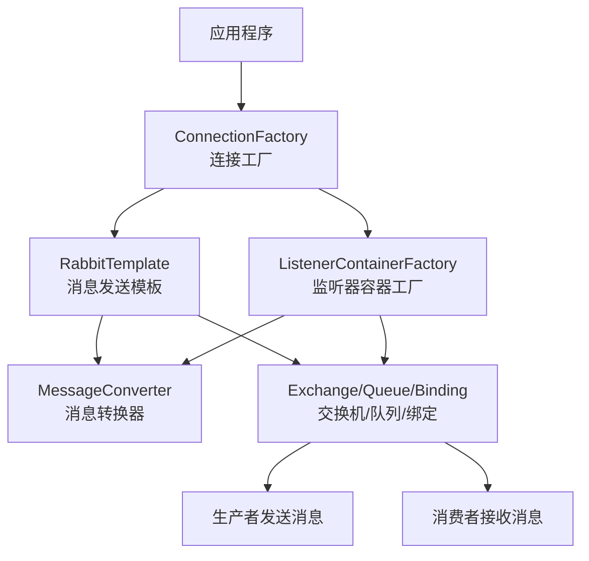

在 Spring Boot 中配置 RabbitMQ 需要设置一系列核心 Bean 来建立消息发送和接收的完整管道。下面这个流程图直观地展示了这些核心组件如何协同工作：



下面详细介绍每个核心 Bean 的配置方法和作用：

## 🔧 核心 Bean 配置详解

### 1. ConnectionFactory（连接工厂）
作用：创建到 RabbitMQ 服务器的连接，是其他所有组件的基础。

```yaml
# 基础配置（application.yml）
spring:
  rabbitmq:
    host: localhost
    port: 5672
    username: guest
    password: guest
    virtual-host: /
```

```java
// 自定义连接工厂配置
@Bean
public ConnectionFactory connectionFactory() {
    CachingConnectionFactory connectionFactory = new CachingConnectionFactory();
    connectionFactory.setHost("localhost");
    connectionFactory.setPort(5672);
    connectionFactory.setUsername("guest");
    connectionFactory.setPassword("guest");
    connectionFactory.setPublisherConfirms(true); // 启用发布确认
    return connectionFactory;
}
```

### 2. RabbitTemplate（消息模板）
作用：用于发送消息的核心组件。

```java
@Bean
@Scope(ConfigurableBeanFactory.SCOPE_PROTOTYPE) // 通常设置为原型
public RabbitTemplate rabbitTemplate(ConnectionFactory connectionFactory) {
    RabbitTemplate template = new RabbitTemplate(connectionFactory);
    template.setMessageConverter(jsonMessageConverter()); // 设置消息转换器
    template.setMandatory(true); // 确保消息无法路由时返回
    
    // 设置确认回调
    template.setConfirmCallback((correlationData, ack, cause) -> {
        if (ack) {
            System.out.println("消息发送成功");
        } else {
            System.out.println("消息发送失败: " + cause);
        }
    });
    
    return template;
}
```

### 3. MessageConverter（消息转换器）
作用：在 Java 对象和消息体之间进行转换，常用 JSON 格式。

```java
@Bean
public MessageConverter jsonMessageConverter() {
    return new Jackson2JsonMessageConverter();
}
```

### 4. 消息模型组件（队列、交换机、绑定）

#### 队列配置
```java
@Bean
public Queue myQueue() {
    return new Queue("myQueue", true); // true表示持久化
}
```

#### 交换机配置（支持多种类型）
```java
// Direct交换机（直连）
@Bean
public DirectExchange directExchange() {
    return new DirectExchange("directExchange");
}

// Topic交换机（主题）
@Bean
public TopicExchange topicExchange() {
    return new TopicExchange("topicExchange");
}

// Fanout交换机（扇出）
@Bean
public FanoutExchange fanoutExchange() {
    return new FanoutExchange("fanoutExchange");
}
```

#### 绑定配置
```java
@Bean
public Binding binding(Queue queue, DirectExchange exchange) {
    return BindingBuilder.bind(queue).to(exchange).with("routing.key");
}
```

### 5. 消息监听容器工厂
作用：配置消息监听器的行为，如并发、确认模式等。

```java
@Bean
public SimpleRabbitListenerContainerFactory rabbitListenerContainerFactory(
        ConnectionFactory connectionFactory) {
    SimpleRabbitListenerContainerFactory factory = new SimpleRabbitListenerContainerFactory();
    factory.setConnectionFactory(connectionFactory);
    factory.setConcurrentConsumers(3);     // 最小消费者数量
    factory.setMaxConcurrentConsumers(10); // 最大消费者数量
    factory.setAcknowledgeMode(AcknowledgeMode.MANUAL); // 手动确认
    factory.setMessageConverter(jsonMessageConverter());
    return factory;
}
```

## ⚙️ 完整配置示例

```java
@Configuration
@EnableRabbit // 启用RabbitMQ注解
public class RabbitMQConfig {
    
    // 1. 消息转换器
    @Bean
    public MessageConverter jsonMessageConverter() {
        return new Jackson2JsonMessageConverter();
    }
    
    // 2. 队列声明
    @Bean
    public Queue orderQueue() {
        return new Queue("order.queue", true);
    }
    
    // 3. 交换机声明
    @Bean
    public DirectExchange orderExchange() {
        return new DirectExchange("order.exchange");
    }
    
    // 4. 绑定关系
    @Bean
    public Binding orderBinding(Queue orderQueue, DirectExchange orderExchange) {
        return BindingBuilder.bind(orderQueue).to(orderExchange).with("order.routing");
    }
    
    // 5. RabbitTemplate
    @Bean
    public RabbitTemplate rabbitTemplate(ConnectionFactory connectionFactory) {
        RabbitTemplate template = new RabbitTemplate(connectionFactory);
        template.setMessageConverter(jsonMessageConverter());
        return template;
    }
    
    // 6. 监听容器工厂
    @Bean
    public SimpleRabbitListenerContainerFactory rabbitListenerContainerFactory(
            ConnectionFactory connectionFactory) {
        SimpleRabbitListenerContainerFactory factory = new SimpleRabbitListenerContainerFactory();
        factory.setConnectionFactory(connectionFactory);
        factory.setMessageConverter(jsonMessageConverter());
        factory.setConcurrentConsumers(3);
        factory.setMaxConcurrentConsumers(10);
        return factory;
    }
}
```

## 🔄 生产者与消费者配置

### 生产者示例
```java
@Service
public class OrderService {
    @Autowired
    private RabbitTemplate rabbitTemplate;
    
    public void sendOrder(Order order) {
        rabbitTemplate.convertAndSend("order.exchange", "order.routing", order);
    }
}
```

### 消费者示例
```java
@Component
public class OrderListener {
    
    @RabbitListener(queues = "order.queue")
    public void handleOrder(Order order) {
        // 处理订单消息
        System.out.println("收到订单: " + order.getId());
    }
}
```

## 💡 高级配置选项

### 1. 消息确认机制
```yaml
spring:
  rabbitmq:
    publisher-confirms: true    # 发布者确认
    publisher-returns: true     # 发布者返回
```

### 2. 监听器配置
```yaml
spring:
  rabbitmq:
    listener:
      simple:
        acknowledge-mode: manual  # 手动确认
        concurrency: 3           # 最小并发数
        max-concurrency: 10      # 最大并发数
        prefetch: 1              # 每个消费者预取消息数
```

## ⚠️ 常见问题与解决方案

1. 连接多个 RabbitMQ 服务器：需要配置多个 `ConnectionFactory` Bean
2. 消息序列化问题：统一使用 JSON 消息转换器
3. 消息确认机制：生产环境建议使用手动确认模式