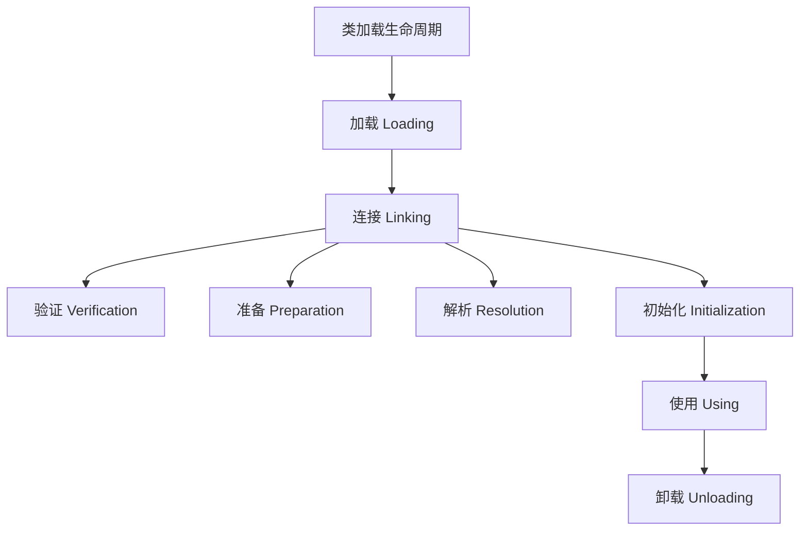

### 加载阶段

- 含义：JVM将类的字节码数据**读入内存方法区**并**创建相应`Class`对象**的过程。

- 实现基础：InstanceKlass是方法区中的本体，java.lang.Class对象是堆中反映本体的镜像，二者双向引用![[Pasted image 20251209131550.png]]
	1.  `instanceKlass`：是JVM底层用于描述Java类的C++对象
		- 位置：方法区
		- 包含内容：
			- 类的所有元数据（如字段、方法、常量池、虚方法表等）。
			- 其中`_java_mirror`字段：指向所描述的Class在堆中的`Class`对象
				- 这个 `Class`实例就像是 `InstanceKlass`的一个“镜像”或“代理”，专门暴露给 Java 应用程序使用
	2.  `Class`对象：是`java.lang.Class`的一个实例。
		- 位置：Java堆
		- 定位：这个 `Class`实例就像是 `InstanceKlass`的一个“镜像”或“代理”
		- 作用：专门用于把C++的instanceKlass对象暴露给 Java 应用程序使用
			- 使得Java程序能够通过反射等方式访问到方法区中的类元数据。
		-  **隐藏字段**（通常名为 `klass`）：用于指回其对应的 `InstanceKlass`对象
			- 实现与Class和 `instanceKlass`的双向引用

- 工作流程：
	1.  获取二进制字节流：JVM会通过类的全限定名（如 `java.lang.Object`）来获取定义此类的二进制字节流（类文件）。
		- 如果这个类还有父类没有加载，先加载父类
		- 字节流来源：
			- 通常来源于本地文件系统的`.class`文件
			- 网络
			- JAR包
			- 运行时动态生成（如动态代理）。
	2.  转换存储结构：将类文件加载到方法区中，以 `instanceKlass`C++对象进行封装
	3.  创建Class对象：在内存中（对于HotSpot虚拟机来说是在Java堆中）生成一个代表该类的 `java.lang.Class` 对象。
### 链接阶段
设计目的：将加载到内存的类“拼接”到JVM运行环境中，确保其能够正确、安全地与其他组件交互。
1. 验证：确保被加载的类字节码是合法、安全且符合JVM规范的。
	1. 文件格式验证：检查字节流是否符合Class文件格式规范
		-  是否以正确的魔数（Magic Number，`0xCAFEBABE`**）​** 开头
		- 主次版本号是否在当前JVM处理范围内。
	2. 元数据验证：对字节码进行语义分析，确保其符合Java语言规范。比如，检查这个类是否有父类（除`Object`外都应有父类），是否继承了被`final`修饰的类，非抽象类是否实现了所有抽象方法等。
	3. 字节码验证：这是最复杂的一步，**通过数据流和控制流分析，确定程序语义是合法的、符合逻辑的**。例如，保证跳转指令不会跳转到方法体以外的字节码指令上，方法体中的类型转换是有效的。
	4. 符号引用验证：发生在虚拟机将符号引用转换为直接引用的时候，即解析阶段。
		- 存在性：它检查符号引用所指向的类、字段、方法是否存在
		- 可访问性：且当前类是否有权限访问它们。
    
2. 准备：为类的静态变量（static变量）分配内存，并设置其默认初始值（零值）、
	- **特殊情况**：类变量同时被 `final static`修饰，且其值是编译期常量（如 `public static final int CONSTANT = 123;`）
		- 那么该字段在编译期就会被加入到常量池中。因此，在准备阶段就会直接赋值为 `123`，而非 `0`。
3. 解析：将常量池中的符号引用转换为直接引用
	- **符号引用**：是一组无歧义的符号（如全限定名）来描述所引用的目标，与虚拟机内存布局无关。例如，在Class文件中，通过字符串 `"java/io/PrintStream"`和 `"println"`来引用 `System.out.println`方法，这就是符号引用。
	- **直接引用**：可以是直接指向目标的指针、相对偏移量或是一个能间接定位到目标的句柄。直接引用和虚拟机实现的内存布局直接相关，有了直接引用，引用的目标必定已经在内存中存在。
### 初始化阶段
- 工作原理：初始化即调用`<cinit>()v`构造函数
- 特点：
	- 懒加载，需要才初始化
	- 虚拟机会保证这个类的『构造方法』的线程安全
- 发生初始化的情况：
	- 主动
		1. 创建类的实例：例如使用 `new`关键字。
		2. 虚拟机启动时，被标明为启动类的类（即包含 `main`方法的那个类）。
		3. 使用反射进行方法调用时，如 `Class.forName("ClassName")`。
	- 被动：
		1. 访问类的静态变量：但有个例外，如果该静态变量是编译期常量（即被 `static final`修饰，且类型是基本类型或字符串，其值在编译期就能确定），则不会触发初始化
		2. 调用类的静态方法。
		3. 初始化一个子类：当初始化子类时，如果其父类还未初始化，则会先触发父类的初始化
- 不会初始化的情况：
	- 访问类的 static final 静态常量(基本类型和字符串)不会触发初始化
	- 类对象.class 不会触发初始化
	- 创建该类的数组不会触发初始化
	- 类加载器的 loadClass 方法
	- Class.forName的参数2为false 时